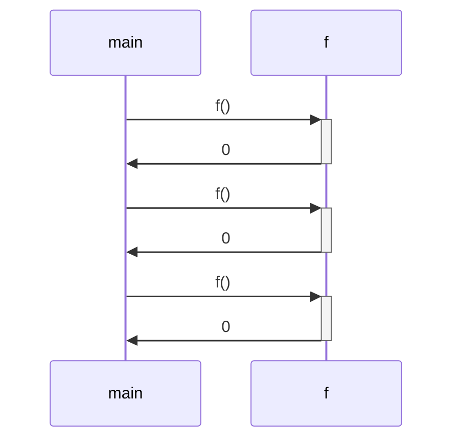
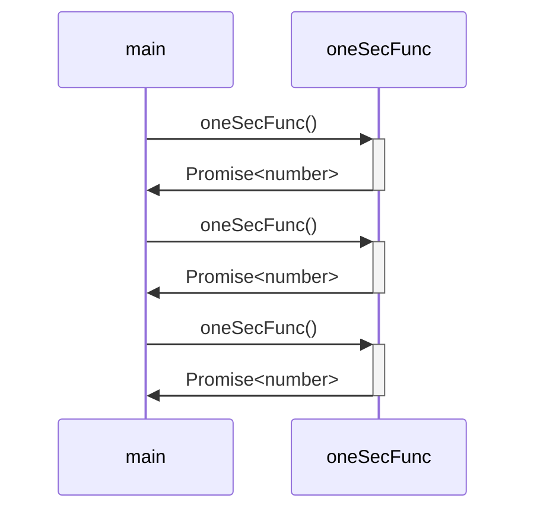
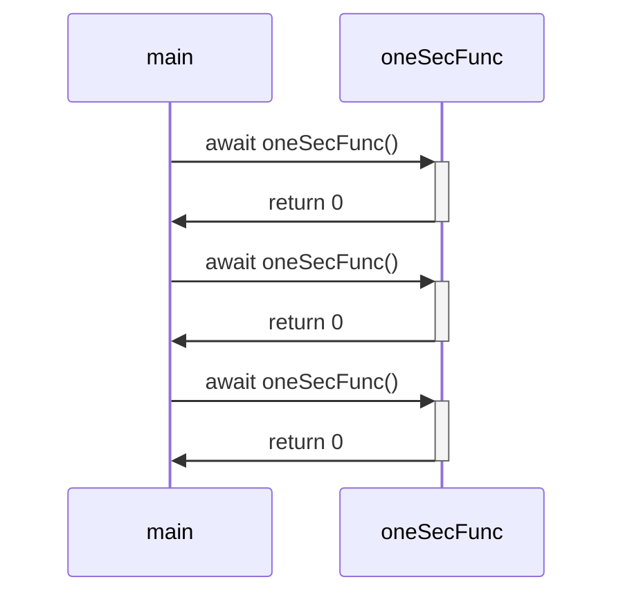

# Async/Await Explained

## syncronous function

```js
function f() {
  return 0;
}

function main() {
  f();
  f();
  f();
}
```



## Asyncronous function

```js
async function oneSecFunc() {}

function main() {
  oneSecFunc();
  oneSecFunc();
  oneSecFunc();
}
```



```js
async function oneSecFunc() {
    ...
    return 0;
}

function main() {
  await oneSecFunc();
  await oneSecFunc();
  await oneSecFunc();
}
```


